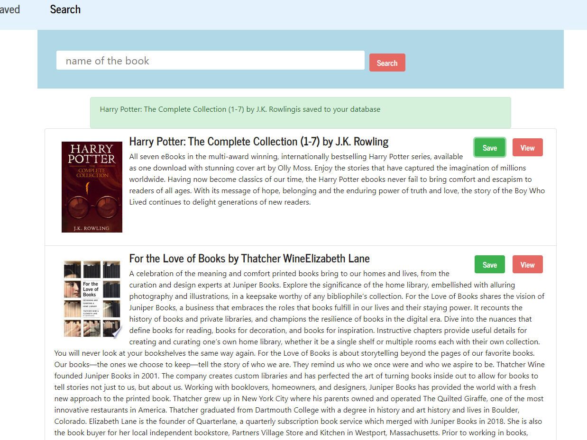
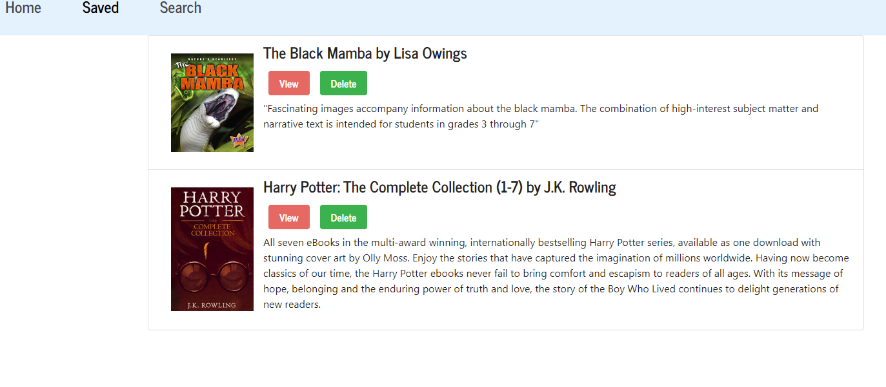

# Google react book search 
# Table of Contents
- [Description](#Description)
- [Technologies](#Technologies)
- [Installation](#Installation)
- [Usage](#Usage)
- [Deployment](#Deployment)
- [Screenshots](#Screenshots)

## Description
**Google react book search** is a full stack app. Which allows user to search for book over online and allows user to save favorite books to the database. For the books we used google book api, front-end is managed by react and back-end is managed by node, express and mongodb database. Upon finishing the reading of that particular book user can delete from the database.
# Technology 
Technolozies utilized are 
- React 
- Node.js 
- Express.js 
- Mongo DB
- HTML & CSS
- Heroku
## Installation
To runs this application you must have Mongo DB,  Node.js and React installed. Once installed:
1. Clone the git hub repo.
2. In the terminal, navigate to source folder and install the required dependencies listed in the package.json file by entering `npm install` or `npm i` and `ENTER`. Navigate to server.js 
## Usage

1. Once the above installation steps have been completed, right click on the `server.js` and `Open in an internal/external terminal`
2. The application is launched by typing `npm start` in the terminal.

# Deployment 
[App](https://vast-waters-78960.herokuapp.com/)
# Screenshots
#### Searched book list

#### Saved books

